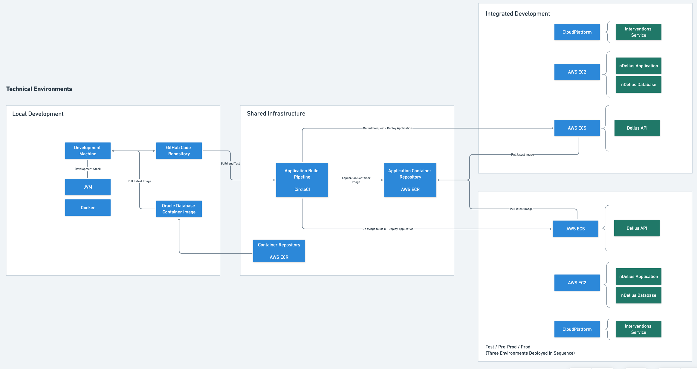

# Delius API Technical Environments

## Build, Test and Deployment Infrastructure 

|  Service | Purpose                                                                                   | URL                                                                          |
|---------:|-------------------------------------------------------------------------------------------|------------------------------------------------------------------------------|
| CircleCI | Build, test, create an application docker image and deploy to the development environment | https://app.circleci.com/pipelines/github/ministryofjustice/hmpps-delius-api |
|  AWS ECR | Host the application docker images                                                        |                                                                              |

## Integrated Development Environment

The first integrated environment used when developing the API service. Builds
made via GitHub pull requests on the Delius API are automatically deployed to
the development environment by the CircleCI build pipeline. This can then be
used to test the API service alongside other dependent services and
particularly alongside the user-facing nDelius application.

|                Component | Deploy Trigger     | URL                                                                                   |
|-------------------------:|:-------------------|---------------------------------------------------------------------------------------|
|       Delius API Service | Pull Request       | https://delius-api.dev.probation.service.justice.gov.uk                               |
|               nDelius UI | Manual via NDST    | https://ndelius.dev.probation.service.justice.gov.uk                                  |
| Interventions Service UI | _Undefined_        | https://hmpps-interventions-ui-dev.apps.live-1.cloud-platform.service.justice.gov.uk/ |
|            Community API | Manual via Digital | https://community-api-secure.int.delius.probation.hmpps.dsd.io/                       |
|               HMPPS-Auth | merge to `main`    | https://sign-in-dev.hmpps.service.justice.gov.uk/                                     |

## Production Pipeline Environments 

The production pipeline is a single flow through Test, Pre-Prod and Production
environments. This means that hot-fixing and feature re-prioritisation is
difficult. To mitigate this it is important that the `main` branch is always
kept in a releasable state. Feature flags should be used for major feature PRs
to ensure this is the case. 

### Test 

The Delius API application is deployed the this environment on merge to the
`main` branch. The nDelius application and database in this environment is
used by the NDST team to test features and run automated QA scripts. Community
API is also deployed to this environment on merge to the `main` branch. 

|                Component | Deploy Trigger  | URL                                                                                   |
|-------------------------:|:----------------|---------------------------------------------------------------------------------------|
|       Delius API Service | merge to `main` | https://delius-api.test.probation.service.justice.gov.uk                              |
|               nDelius UI | Manual via NDST | https://ndelius.test.probation.service.justice.gov.uk                                 |
| Interventions Service UI | _Undefined_     | https://hmpps-interventions-ui-dev.apps.live-1.cloud-platform.service.justice.gov.uk/ |
|            Community API | merge to `main` | https://community-api-secure.test.delius.probation.hmpps.dsd.io/                      |
|               HMPPS-Auth | merge to `main` | https://sign-in-dev.hmpps.service.justice.gov.uk/                                     |

### Pre-Prod 

A representative environment with full integrated services which also contains a
production dataset. This environment should be treated like production from a
data protection perspective.

|                Component | Deploy Trigger       | URL                                                          |
|-------------------------:|:---------------------|--------------------------------------------------------------|
|       Delius API Service | CircleCI Approval    | https://delius-api.pre-prod.probation.service.justice.gov.uk |
|               nDelius UI | Manual via NDST      | https://ndelius.stage.probation.service.justice.gov.uk       |
| Interventions Service UI | _Undefined_          |                                                              |
|            Community API | _CircleCI Approval?_ |                                                              |
|               HMPPS-Auth | _CircleCI Approval?_ |                                                              |
    
### Production

The production environment. 

|                Component | Deploy Trigger       | URL                                                      |
|-------------------------:|:---------------------|----------------------------------------------------------|
|       Delius API Service | CircleCI Approval    | https://delius-api.prod.probation.service.justice.gov.uk |
|               nDelius UI | Manual via NDST      | https://ndelius.prod.probation.service.justice.gov.uk    |
| Interventions Service UI | _Undefined_          |                                                          |
|            Community API | _CircleCI Approval?_ |                                                          |
|               HMPPS-Auth | _CircleCI Approval?_ |                                                          |

## Environment Information

### nDelius 

- https://ministryofjustice.github.io/delius-versions-dashboard/

