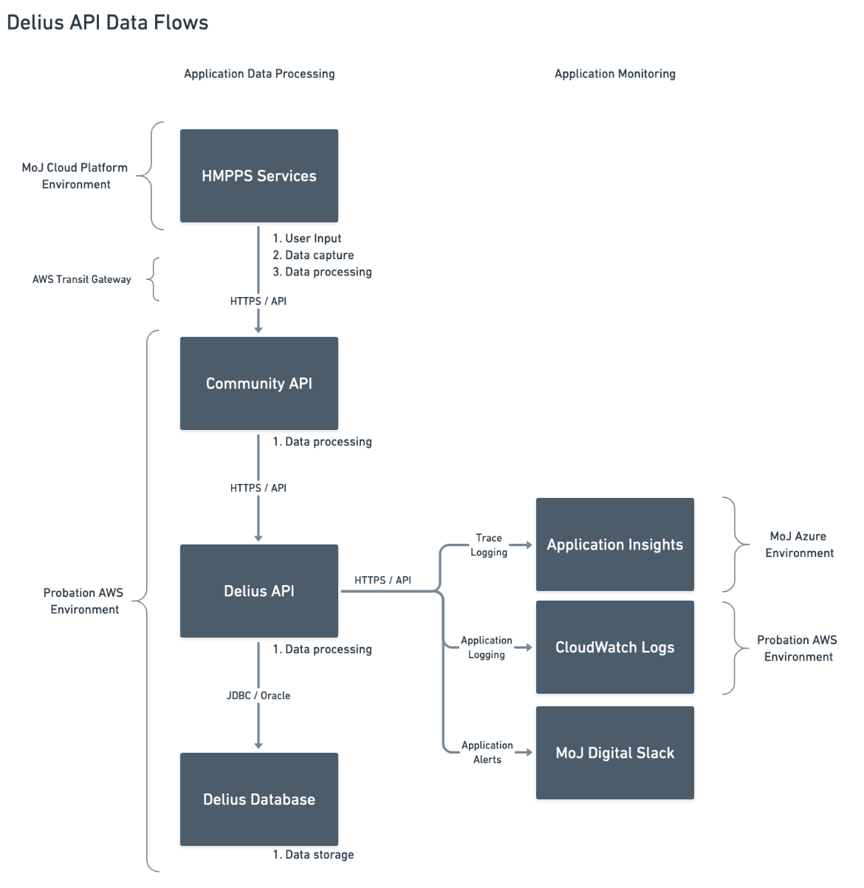

# Delius API Security

## Surface Area
- Writing to the Delius database via JDBC
- Writing to the Delius database as a Delius user
- Creating contact data attached to a service user's sentence
- This contact data may be either informational (e.g. notification that
  something has been recorded in another service) or the primary record of a
  specific activity (e.g. creating an appointment)

## Impact
- Recording primary records of a Service User's interaction with the
  probation service is a high-impact activity with the potential to affect
  decisions on the service user's compliance
-

## Threat Model
### Internal MoJ users
- Accessing or changing Service User information without authorisation
- Accessing or changing Service User information without audit records or log
  entries being written
### External Users
- Accessing or changing Service User information without authorisation

## Threat Landscape
- Delius API is an internal MoJ system with no public access to the running
  service
### Information Disclosure
- Delius API is not used for reading data from Delius
- The service can connect to the Delius database as a client user and assume
  the permissions of that user

## Data Flows
- Data flows to the Delius API from client services
- Delius API provides a restricted set of services to internal MoJ clients
- Client services for functional API endpoints are network restricted to those
  running in the Probation AWS cloud environment

